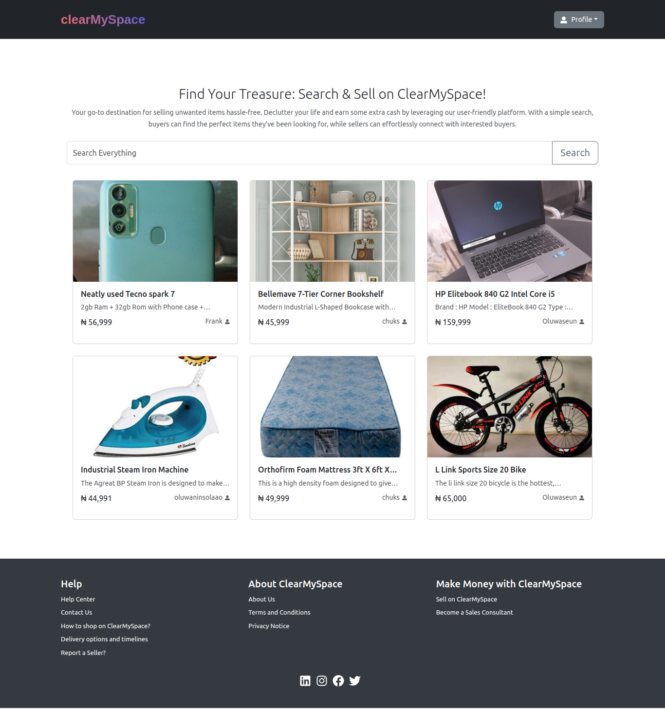

# Clear My Space

ClearMySpace is an online platform designed to help individuals
declutter their homes and sell unwanted items to others who may be
looking for them. By listing items on ClearMySpace, users can
connect with buyers in their area and exchange goods in a safe and
convenient way. ClearMySpace provides a user-friendly interface that
makes it easy to list, browse, and purchase items, as well as
features such as reviews and ratings to ensure trust and transparency
in the exchange process. With ClearMySpace, users can simplify their
lives, earn extra cash, and promote a more sustainable and
eco-friendly way of living.



### TECHNOLOGIES

1. Python: programming language
1. Flask: a web framework for Python
1. MySQL: relational database management system
1. SQLAlchemy: Python SQL toolkit and ORM
1. HTML, CSS javascript, jQuery (and/or ReactJS): front-end

Alternative options considered:

**Database: Mysql vs PostgreSQL**
The trade-offs between MySQL and PostgreSQL are mainly related to the
specific needs of the project. MySQL is often favored for its ease of
use, speed, and scalability. It also has a strong community and many
third-party tools available. PostgreSQL, on the other hand, is known
for its robustness, reliability, and advanced features.
Ultimately, we chose MySQL for this project due to its ease of use,
speed, and scalability, which are important factors in building an
e-commerce API. Additionally, we had prior experience with MySQL and
felt comfortable working with it.

**Web framework: Flask vs Django**
Flask is a lightweight and flexible micro-framework that is
well-suited for small to medium-sized web applications. Additionally,
we had prior experience with Flask and felt comfortable working with
it.

### CHALLENGE

ClearMySpace is intended to solve the problem of clutter in people's
homes. Many individuals have unwanted items in their homes that
take up valuable space, cause stress, and contribute to waste.

ClearMySpace provides a platform for individuals to declutter their
homes and sell unwanted items to others who may be looking for them,
thereby reducing waste and promoting a more sustainable and
eco-friendly way of living.

ClearMySpace is not intended to solve larger social or environmental
issues such as poverty or climate change. It is also not intended to
be a solution for individuals who are hoarding or have a compulsive
shopping disorder.

The ClearMySpace project will help individuals who are looking to
declutter their homes and sell unwanted items. It will also help
buyers who are looking for specific items at a lower cost than
buying them new.

While ClearMySpace can be used by anyone, it may be more relevant
or useful in areas with a higher population density or a culture of
buying and selling second-hand items. However, the platform can be
used by anyone with an internet connection and access to the app or
website.

### TEAM

1. Team Member 1: Abraham OLAGUNJU - Full-Stack Developer
1. Team Member 2: Chukwudi ONYENIKE - Full-Stack Developer

[Read More About the project here!](https://docs.google.com/document/d/1ADEp8iA4lPIjqcgZSQ1AkKpEK3MMria0KNvj8GMK0mc/edit?usp=sharing)

## Clone the Repository

1. Open your terminal or command prompt.
1. Change the directory to the location where you want to clone the repository.
1. Run the following command to clone the repository:

```
git clone https://github.com/FearGod12/clearmyspace.git
```

1. Wait for the cloning process to complete. Once finished, you will have a local copy of the repository on your machine.

## Install Dependencies

Ensure you have installed the following packages relevant to this project depending on which operating system you are using:

1. MySQL Client
1. Python3 & pip3
1. NodeJS
1. Nginx

Once all the requirements above are satisfied, proceed to installing python's dependencies, use the following command from your terminal at the project's root directory:

```
pip3 install -r requirements.txt
```

## Set up MySQL Database with required credentials

To setup and configure MySQL database, user and all required permissions, use the following command from the terminal at the project's root directory:

```
cat cms_db_user_setup.sql | mysql -u root -p
```

> !important: it is important to first inspect the sql script and modify all named fields or use the defaults. ;) As the named fields will be part of what will form your environment variables while starting or deploying the application on a server.

> If `root` is not your default mysql username, feel free to update the command.

## Start API flask server

From the project's root directory run the following command to start the Flask server using the following command conatining all necessary and required `environment variables`:

```
CMS_MYSQL_USER=cms_dev CMS_MYSQL_PWD=cms_dev_pwd CMS_MYSQL_HOST=localhost CMS_MYSQL_DB=cms_dev_db API_SECRET_KEY='af4929f813c57dab0a59c8b5ef21424e22ae6b6b9d2b42545f2026f7db038f33' python3 -m api.v1.app
```

## Start NodeJS (ReactJS) Application Server

Change your directry to the `front-end` directory, first install all npm dependencies (`npm install`) then start the application (`npm start`)

```
npm install
...
npm start
```

Enjoy!
